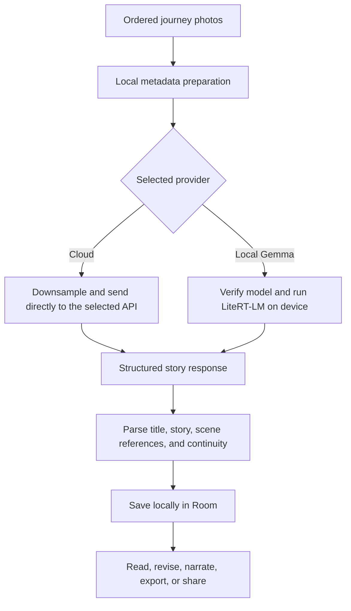

# Pluck


**Real places. Entirely fictional stories.**

Pluck is a local-first Android app for turning a day of captured places into one continuous piece of fiction. Capture a photo at each stop, keep the sequence, choose a mood, and let Pluck write a story in which every place matters to the plot.

There is no AI chat interface, no account, no advertising, no analytics, and no Pluck backend.

## What you can do

- Capture a photo, timestamp, optional coordinates, and approximate address at each place.
- Follow the day in an animated timeline, including a private on-device route sketch when two or more captures have location data.
- Generate a fictional story from the ordered journey with Gemini, OpenAI, Claude, Groq, Together AI, OpenRouter, or Local Gemma.
- Choose a narrative mood: Cinematic, Mysterious, Whimsical, Warm, Adventurous, or Dark.
- Add optional fictional direction such as genre, protagonist name, and companions. These are writing instructions only; Pluck never treats them as image-identification facts.
- Regenerate without chat using concise choices such as **More mysterious**, **Shorter**, **More emotional**, or **Change mood**.
- Read stories in a mood-aware reader with a generated typographic cover, progress tracking, Reality vs Fiction references, and local audiobook controls.
- Browse past journeys grouped by week, month, mood, or season.
- Group daily journeys into a continuing multi-day novella with a shared fictional world and continuity hand-off between chapters.
- Export one story or a month of stories as a PDF book or EPUB, with selected photos, chapter headers, deterministic cover art, and a private route sketch.
- Create local share cards in portrait, Instagram Story, or X/Twitter landscape formats. Shared images omit photo metadata.
- Add the **Capture next place** widget to see Local Gemma readiness and start today’s capture flow.
- Open a bundled **20-place demo journey** made from original illustrations. It seeds images and fictional local metadata only—never a prewritten story—so generation remains live for presentations.

## Privacy at a glance

| Area | Local Gemma | Cloud provider |
| --- | --- | --- |
| Photos, route, and story database | Stored on this device | Stored on this device |
| Story-generation input | Never leaves the device | Sent directly to the provider selected by the user |
| API key | Not required | Stored in Android Keystore-backed encrypted preferences |
| Internet after setup | Not required | Required |
| Pluck account or server | Never used | Never used |

When a cloud provider is selected, the ordered images and the story prompt (which can include time and location hints) are sent to that provider’s API. Choose Local Gemma when you want the complete generation path to stay on-device.

## Local Gemma

Local Gemma is experimental and designed for capable devices such as the Samsung Galaxy S23. It uses Google AI Edge LiteRT-LM with the pinned **Gemma 4 E2B Instruct** LiteRT-LM release.

1. Open **Settings → Local AI**.
2. Review the storage requirement and explicitly confirm the download.
3. Pluck resumes the fixed HTTPS download when supported, checks its SHA-256 digest, and only then installs it in app-private no-backup storage.
4. Select **Local Gemma** as the preferred provider.
5. Generate stories in airplane mode.

The app does not bundle a model, accept a manual model URL, import a model file, or run an unverified model. The fixed model manifest is compiled into the app: repository, revision, filename, and SHA-256 cannot be changed in Settings. The distribution route is the Google-documented LiteRT Community channel hosted on Hugging Face—not a user-provided or arbitrary mirror. See the [Google AI Edge LiteRT-LM Kotlin guide](https://github.com/google-ai-edge/LiteRT-LM/blob/main/docs/api/kotlin/getting_started.md) for the supported model-distribution guidance.

The current download is about **2.58 GB**; Pluck asks for about **4.5 GB** of free private storage to allow a safe installation and runtime cache. The Local AI screen shows readiness, storage, verification state, progress, update availability, and device guidance. A newer release is reported, but a new pinned integrity manifest is delivered with an app update—Pluck never silently switches to an unpinned model.

## Story-generation flow



The shared prompt contract asks the provider to analyze the entire ordered image sequence, retain fictional continuity, avoid a photo-by-photo diary, and return `TITLE`, `STORY`, and `CONTINUITY` fields. Story paragraphs may carry scene markers so the Reality vs Fiction reader can relate a fictional passage to its captured place.

## App structure

```text
app/src/main/java/com/example/pluck/
├── data/
│   ├── database/       Room entities, DAOs, and migrations
│   ├── export/         Local PDF and EPUB creation
│   ├── localai/        LiteRT-LM model management and local provider
│   ├── narration/      Offline Android Text-to-Speech adapter
│   ├── provider/       Cloud StoryProvider implementations
│   └── repository/     Room and settings repositories
├── domain/             Models, repository contracts, use cases
├── ui/                 Compose screens, components, theme, share renderer
├── viewmodel/          Immutable StateFlow UI state
├── navigation/         Navigation Compose graph
├── widget/             Capture-next-place app widget
└── di/                 Hilt bindings
```

The UI talks to use cases and repositories, never to the LiteRT-LM engine or a provider client directly. Every generation path implements the same `StoryProvider` contract, which keeps the UI independent from the selected model.

## Local data model

All persistent app data is stored in a Room-managed SQLite database on the device.

| Entity | Purpose |
| --- | --- |
| `journeys` | One daily journey, keyed by date and time zone. |
| `journey_photos` | Local image path, capture time, optional coordinates, and address. |
| `stories` | Fictional story text, provider, mood, and optional creative settings. |
| `story_scenes` | Local link between a story paragraph and a captured photo. |
| `novella_arcs` | Multi-day fictional arc settings and dates. |
| `novella_chapters` | Ordered journey-to-chapter membership, story, and continuity summary. |

Migrations preserve existing journeys and stories. In particular, the v2 → v4 migration adds creative direction, scene references, and novella data without destructive database resets.

## Cloud providers and keys

Pluck supports these user-configured providers:

- Google Gemini
- OpenAI
- Anthropic Claude
- Groq
- Together AI
- OpenRouter

Only the selected cloud provider needs a key. Each provider has its own field and connection test in Settings. Keys are stored with `EncryptedSharedPreferences`, backed by an Android Keystore `MasterKey`; the app never ships a key.

## Interface and accessibility

The UI is built with Jetpack Compose and Material 3. It supports dynamic color, system/light/dark themes, edge-to-edge layouts, adaptive widths, expressive tonal surfaces, haptic preferences, and reduced-distraction motion. All primary interactions maintain a 48dp touch target and use accessible labels.

## Build and run

### Requirements

- Android Studio with Android SDK 36 installed
- JDK 11
- Android 7.0 / API 24 or newer device or emulator
- A physical Android device for CameraX, location, Local Gemma, widget, and TTS verification

### Debug build

```bash
./gradlew :app:assembleDebug
```

The APK is written to:

```text
app/build/outputs/apk/debug/app-debug.apk
```

Install it from Android Studio or with ADB:

```bash
adb install -r app/build/outputs/apk/debug/app-debug.apk
```

### First-run checklist

1. Complete the minimal onboarding and optionally enter a preferred name.
2. Grant camera permission; grant location permission if you want address and private route features.
3. In Settings, choose either a cloud provider and enter its API key, or download Local Gemma.
4. Start today’s journey, capture at least two places, then generate a story.

### Hackathon demo journey

The Home screen includes **Open demo journey · 20 original images**. It creates one local, asset-backed journey with twenty original illustrated places, fictional timestamps, synthetic route coordinates, and fictional addresses. It deliberately creates no `Story` record. Pick a provider and press Generate to demonstrate the actual live story pipeline without personal photos.

## Technology

- Kotlin, Jetpack Compose, Material 3, Navigation Compose
- MVVM, repository pattern, clean layer boundaries, Hilt
- Room 2.7.2, Coroutines, StateFlow, Kotlinx Serialization
- CameraX 1.5.0, Fused Location Provider, Android Geocoder
- Retrofit 2.11.0, OkHttp, Coil
- AndroidX Security Crypto for encrypted settings
- Google AI Edge LiteRT-LM 0.14.0 for optional on-device inference
- Android `TextToSpeech` restricted to installed offline voices

## Validation still recommended before release

The project builds as a debug application. Before publishing, validate the complete flow on a real target device—especially the S23—for model download, verified offline generation, camera/location permissions, thermal behavior, export/open flows, sharing, offline TTS voices, and each cloud provider with a real user key. Add regression coverage for Room migrations and model download/verification failures before treating a release build as production-ready.

---

**Project by Hariom Sharnam**
