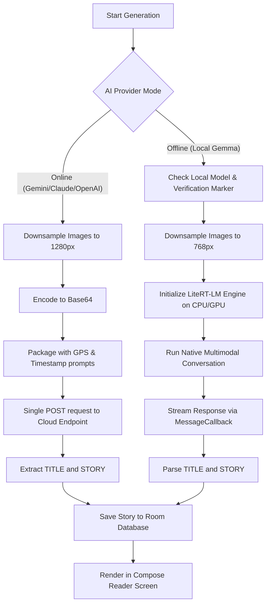

# Pluck

Turn your journey into a story.

## What is Pluck?

Pluck is a private-by-design Android application that turns your daily travels into creative fiction. As you go about your day, you capture one photo at each new place you visit (a coffee shop, a park, a station, etc.). At the end of the day, Pluck packages the photos and their metadata (timestamps, coordinates, and reverse-geocoded addresses) and sends them to an AI story engine to write a continuous, made-up story where each place serves as a scene.

The locations and visual details are real, but the story is pure imagination. The same journey through the same three places could become a fantasy quest one day and a noir detective mystery the next.

---

## Technical Architecture & Pipelines

Pluck is engineered with an entirely local-first data model, strict boundary layers, and a robust processing pipeline for both cloud and local inference.

### 1. The Photo Capture & Geocoding Pipeline

When a user snaps a photo in the app:
1. **CameraX Capture**: The camera interface captures a JPEG and stores it in the app's secure `noBackupFilesDir` cache directory.
2. **Fused Location Capture**: Simultaneously, Pluck requests location coordinates from Google Play Services using `PRIORITY_BALANCED_POWER_ACCURACY` with fallback to the last known device location.
3. **Reverse Geocoding**: If a location is acquired, Android's `Geocoder` performs reverse geocoding on a background thread (`Dispatchers.IO`) to fetch a human-readable street address.
4. **Room DB Persistence**: The photo path, precise timestamp, GPS coordinates, and address text are recorded as a new `JourneyPhotoEntity` linked to today's `JourneyEntity`.

### 2. The Multimodal Cloud Pipeline

When generating stories using online models (Gemini 2.5 Flash, Claude 3.5 Sonnet, GPT-4o mini, Groq, Together AI, or OpenRouter):
1. **Image Downsampling**: JPEGs are downsampled on-device to a maximum edge size of 1280px using dynamic `inSampleSize` decoding. This optimizes upload latency and stays within API payload limits.
2. **Base64 Packaging**: The downsampled images are compressed to 82% quality and encoded to Base64 strings.
3. **Structured Prompt Construction**: Timestamps, geocoded addresses, and coordinates are appended as scene text hints alongside the images.
4. **Single-Shot Multimodal Request**: The request is dispatched as a single HTTP `POST` payload. This allows the model to analyze all images in context simultaneously, maintaining perfect character, setting, and plot continuity.
5. **Regular Expression Parsing**: The cloud response is parsed via a case-insensitive regular expression pattern to isolate the title and story:
   - `TITLE: <title>`
   - `STORY: <content>`

### 3. The Offline On-Device AI Pipeline (Local Gemma)

For 100% offline generation in airplane mode:
1. **Secure Model Manager**:
   - The app verifies the cryptographic integrity of the downloaded Gemma model file (`gemma-4-E2B-it.litertlm`) against a hardcoded SHA-256 hash.
   - It maintains a dedicated verification marker file to ensure unverified or corrupted downloads are automatically cleaned up.
2. **Memory-Optimized Downsampling**:
   - On-device models have strict RAM budgets. Images are downsampled to a maximum edge of 768px.
3. **LiteRT-LM Engine Setup**:
   - The app initializes a native **LiteRT-LM** (TensorFlow Lite) engine cache.
   - Configures CPU backend threads (4 threads) for text generation, and GPU backend delegates for vision processing.
4. **Cancellable Async Token Streaming**:
   - Pluck uses the native `MessageCallback` callback interface bridged to Kotlin coroutines via `suspendCancellableCoroutine`.
   - This bypasses binary compatibility limitations of LiteRT-LM's experimental Flow API, ensuring smooth streaming without native memory crashes.
5. **Structured Local Parser**:
   - Extracts the final local story text structure and saves it to the local SQLite database.

---

## Database Architecture & Schema

Pluck stores all session data in a local **SQLite** database managed via **Room**. 

### Entity Models

* **`Journey`**: Represents a distinct day of travel.
  - `id`: Long (Primary Key, AutoGenerate)
  - `date`: String (Format: `yyyy-MM-dd` - unique identifier per day)
  - `timeZoneId`: String (System timezone)
  - `createdAt`: Long
* **`JourneyPhoto`**: Stores photo metadata for each stop.
  - `id`: Long (Primary Key, AutoGenerate)
  - `journeyId`: Long (Foreign Key -> `Journey.id` with Cascade Delete)
  - `imagePath`: String (Local absolute path to file)
  - `timestamp`: Long
  - `latitude`: Double?
  - `longitude`: Double?
  - `address`: String?
* **`Story`**: Stores the generated creative book.
  - `id`: Long (Primary Key, AutoGenerate)
  - `journeyId`: Long (Foreign Key -> `Journey.id` with Cascade Delete)
  - `title`: String
  - `content`: String (Fictional narrative)
  - `provider`: String (Name of the AI provider used)
  - `createdAt`: Long

---

## Security & Secrets Storage

API key protection is critical since users supply their own keys.
* **MasterKey Backed Encryption**: Pluck initializes a MasterKey with an `AES256_GCM` scheme backed by the **Android Keystore System**.
* **Encrypted Preferences**: Key strings are persisted inside an `EncryptedSharedPreferences` container, encrypting keys with `AES256_SIV` and values with `AES256_GCM`.
* Pluck has no central cloud database, no accounts, and no trackers—everything is securely confined to your device.

---

## Tech Stack

- **Platform & UI**: Android (Kotlin, Jetpack Compose, Material 3)
- **Architecture**: MVVM with Repository pattern
- **Dependency Injection**: Dagger Hilt
- **Local Database**: Room DB
- **Camera API**: CameraX
- **Location Services**: Play Services Location (`FusedLocationProviderClient`) & `Geocoder`
- **Network Stack**: OkHttp, Retrofit, and Kotlinx Serialization
- **On-Device LLM**: Google AI Edge LiteRT-LM (v0.14.0)

---
Project by Hariom Sharnam
